# sroll resize 使用函数节流实现不要频繁触发事件的需求

利用定时器，让函数执行延迟500毫秒，在500毫秒内如果有函数又被调用则删除上一次调用，这次调用500毫秒后执行，其实本意只是窗口resize后页面做一些调整就可以，而window的resize事件并不是在resize结束后才触发的，具体则么个频率我也不知道，但却是在不停的调用，直到窗口大小不再变化。其实类似的机制还有鼠标的mousemove，都是在短时间内重复触发。

```js
function resizehandler(){
  console.log(new Date().getTime());
}
function throttle(method,context){
  clearTimeout(method.tId);
  method.tId=setTimeout(function(){
    method.call(context);
  },500);
}
window.onresize=function(){
  throttle(resizehandler,window);
};
```

throttle()函数接受两个参数 ，要执行的函数以及在哪个作用域中执行。上面这个函数首先清除之前设置的任何定时器。定时器 ID 是存储在函数的 tId 属性中的，第一次把方法传递给 throttle()的时候，这个属性可能并不存在。接下来，创建一个新的定时器，并将其 ID 储存在方法的 tId 属性中。

如果这是第一次对这个方法调用 throttle()的话，那么这段代码会创建该属性。定时器代码使用call()来确保方法在适当的环境中执行。如果没有给出第二个参数，那么就在全局作用域内执行该方法。

# webpack 打包谈谈怎么优化的

[参考链接](http://www.jianshu.com/p/908c48ced871)

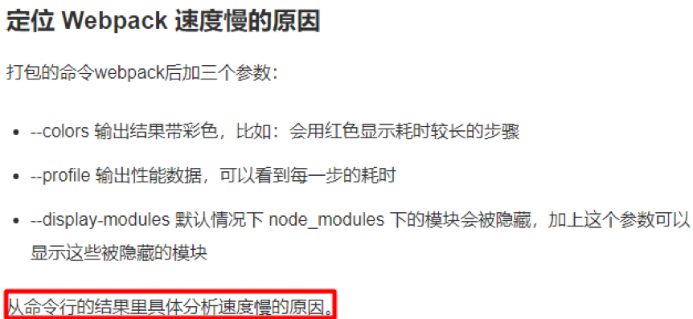

优化方案

通过resolve设置，提高模块分析依赖的速度

（以下是vuecli的webpack中的一些配置）


可以让require模块的定位更快

1. resolve.alias别名是 Webpack 的一个配置项，它的作用是把用户的一个请求重定向到另一个路径 。如果在alias中定义了值，然后在代码中require该值的时候，会重定向到alias指定的位置。

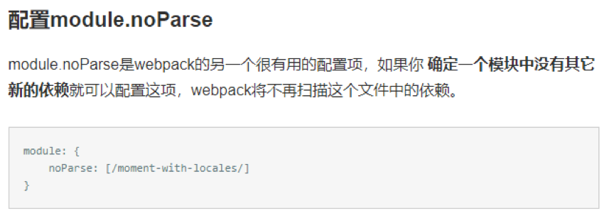

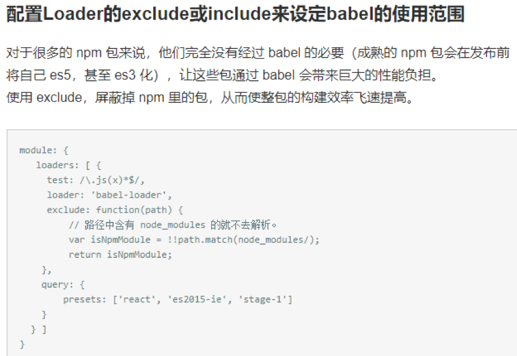

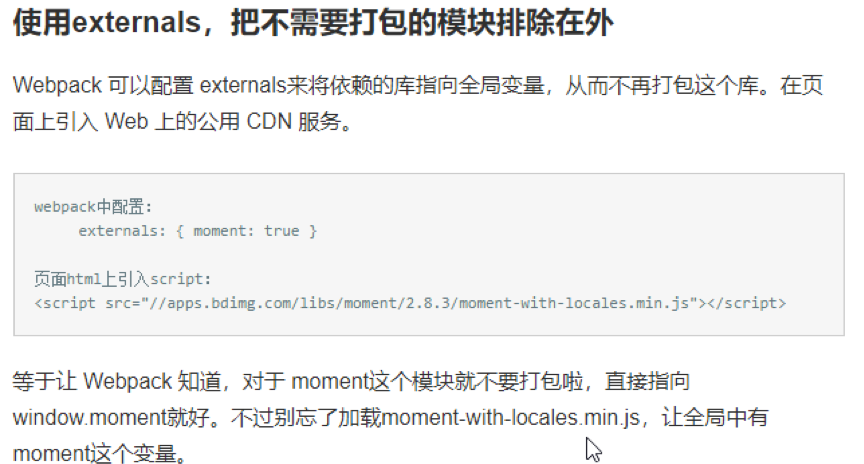

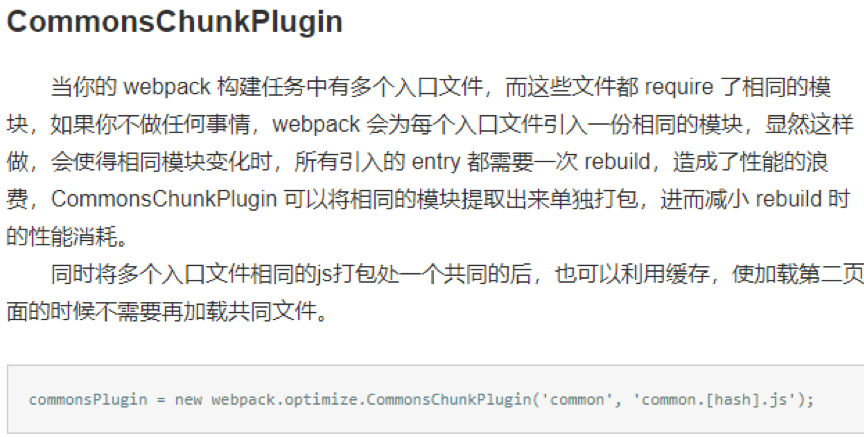

# 手写代码 监测数组变化 并返回数组长度

利用ES6的extends实现（通过ES6的关键字extends实现继承完成Array原型方法的重写）

```js
class NewArray extends Array {
  constructor(...args) {
    super(...args)
  }
  push(...args) {
    super.push(...args)
    console.log('监听到数组的变化啦！长度为', this.length)
    return this.length
  }
  /* 数组的其他方法...
   * pop
   * shift
   * unshift
   * splice
   * sort
   * reverse
  */
}
let list = new NewArray(1, 2, 3)
let length = list.push(2) // 监听到数组的变化啦！长度为4
console.log(length, list)
```

# vue react angular 怎么检测数据变化的

1. Angular
  在angular版本里面还是采用脏值检测来检测数据的变更的，但是和angularjs不一样的是,angular引入了zone.js来处理数据的变更。性能可以达到angularjs脏值检测的3到10倍。详细的文章和资料可以谷歌一下有很多介绍。
2. Vue
  vue.js 则是采用数据劫持结合发布者-订阅者模式的方式，通过Object.defineProperty()来劫持各个属性的setter，getter，在数据变动时发布消息给订阅者，触发相应的监听回调
3. React
  react状态变化只能通过setState,调用setState就会更新状态重新渲染dom

# ES6中，数组监测怎么实现的（代理）

```js
let a = [1, 2, 3, 4]
let b = new Proxy(a, {
  get: function (target, propKey) {
    console.log('正在进行取值操作')
    return target[propKey]
  },
  set: function (target, propKey, value, receiver) {
    console.log('正在进行赋值操作')
    target[propKey] = value
    return true
  }
});
b[2] = 5;
console.log(b[3])
```

# 关于fetch跨域做了什么配置

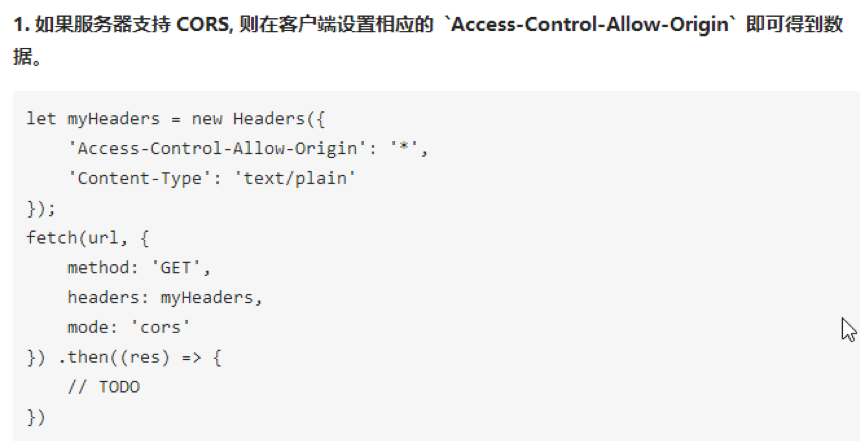

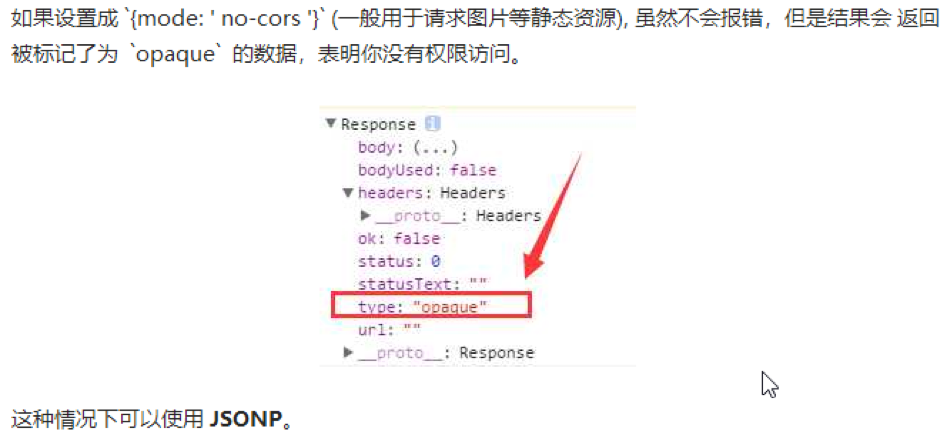

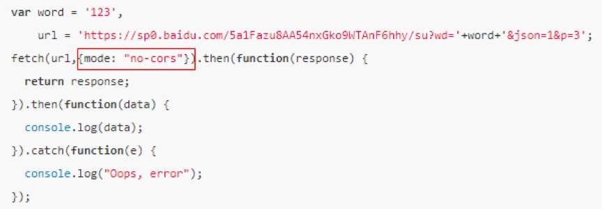


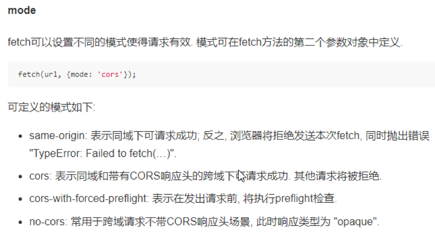

# 模块化循环依赖怎么解开

1 使用build-helper-maven-plugin插件规避。

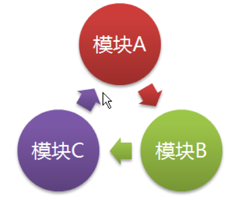

如图所示，A,B,C互相依赖，可以合并为一个中间工程，编译为临时模块D，然后A,B,C分别依赖临时模块D进行编译。这种方法可以解决无法构建问题，但只是一个规避措施，工程关系依然是混乱的。

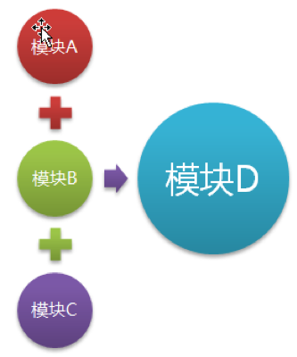

方法二：通过重构，从根本上消除循环依赖

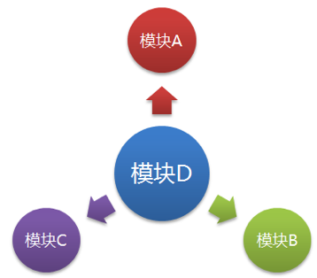

# 深拷贝和浅拷贝

## 浅拷贝

1. 拷贝原对象的引用

  这是最简单的浅拷贝。例：

  ```js
  var a = [{c:1}, {d:2}];
  var b = a.slice();
  console.log(a === b); // 输出false，说明外层数组拷贝的是实例
  a[0].c = 3;
  console.log(b[0].c); // 输出 3，说明其元素拷贝的是引用
  ```

2. 属性拷贝引用。

  ```js
  var a = {c:1};
  var b = a;
  console.log(a === b); // 输出true。
  a.c = 2;
  console.log(b.c); // 输出 2
  ```

  这种情况，外层源对象是拷贝实例，如果其属性元素为复杂杂数据类型时，内层元素拷贝引用。
  对源对象直接操作，不影响两外一个对象，但是对其属性操作时候，会改变两外一个对象的属性的值。

  常用方法为：`Array.prototype.slice()`, `Array.prototype.concat()`, `jQury的$.extend({},obj)`，例：

  ```js
  function simpleClone(initalObj) {
    var obj = {};
    for (var i in initalObj) {
      obj[i] = initalObj[i];
    }
    return obj;
  }
  Object.assign({},obj) // 拷贝的是属性的引用，浅拷贝
  ```

## 深拷贝

`JSON.parse()`
`JSON.stringify()`
`jQury的$.extend(true,{},obj)`
`lodash的_.cloneDeep _.clone(value, true)`

```js
function deepClone(initalObj) {
  var obj = {};
  try {
    obj = JSON.parse(JSON.stringify(initalObj));
  } catch(e) {
    console.log(e)
  }
  return obj;
}
//确定，抛弃了对象的constructor，拷贝之后只是一个Object，RegExp对象不能采用这种方法拷贝
```

```js
function deepClone(initalObj, finalObj) {
  var obj = finalObj || {};
  for (var i in initalObj) {
    // 避免相互引用对象导致死循环，如initalObj.a = initalObj的情况
    if (initalObj[i] === obj) {
      continue;
    }
    if (typeof initalObj[i] === 'object') {
      obj[i] = (initalObj[i].constructor === Array) ? [] : {};
      arguments.callee(initalObj[i], obj[i]);
    } else {
      obj[i] = initalObj[i];
    }
  }
  return obj;
}
```

# this指向

1. 函数在被直接调用的时候，其中的this指针永远指向window
2. 匿名函数this总是指向window对象
3. 谁执行函数，this就指向谁
4. 如果函数new了一下，那么就会创建一个对象，并且this指向新创建的对象

[参考文档](http://www.jianshu.com/p/8ad9a3b9e416)

# sass 语法编写for split 3张背景图

```scss
// 定义背景图片路径这里由颜色代替
$red : #FF0000;
$orange : #FFA500;
$yellow : #FFFF00;
$green : #008000;
$bluegreen : #00FFFF;
$blue : #0000FF;
$purple : #800080;
// 定义一个list储存背景颜色
$bgcolorlist: $red $orange $yellow $green $bluegreen $blue $purple;
// 使用sass for循环语句为每一个li设置background
@for $i from 1 to length($bgcolorlist)+1 {
  #main-container ul li:nth-child(#{$i}) {
    background-color:nth($bgcolorlist,$i);
  }
}
```

# Jquery 优点 缺点

优点

1. JQuery实现脚本与页面的分离
2. 最少的代码做最多的事情
3. 性能支持比较好
4. 它是一个“标准”
5. 插件开发
6. 节约学习成本
7. 让JS编程变得有趣

缺点

1. 不能向后兼容
2. 插件兼容性
3. 多个插件冲突
4. Jquery的稳定性
5. 对动画和特效的支持差

# 防止频繁操作DOM做了哪些优化建议

以一个button的按钮为例子可以使用策略模式,点击一次后让按钮灰掉，暂时不可以用,一段时间后再可以用。
主要的解决思想是函数节流

# vue img图片路径是绝对还是相对

服务器中返回的图片路径一般都是绝对的
如果是本地静态的图片资源需要写相对的路径

# ES6 class关键字 原理 跟function什么区别

在function定义的构造函数中，其prototype.constructor属性指向构造器自身

在class定义的类中，constructor其实也相当于定义在prototype属性上

重复定义

- function会覆盖之前定义的方法
- class会报错

原型或者类中方法的枚举

- class中定义的方法不可用Object.keys(Point.prototype)枚举到
- function构造器原型方法可被Object.keys(Point.prototype)枚举到，除constructor
- 所有原型方法属性都可用Object.getOwnPropertyNames(Point.prototype)访问到
- 都可通过实例的__proto__属性向原型添加方法
- class没有变量提升
- class定义的类没有私有方法和私有属性

# iframe跨域问题 页面之间怎么传值

解决方法一

同域下： 使用 `window.top`或者`window.parent.parent`获取浏览器最顶层`window`对象的引用。 可以使用：`window.parent.parent.document`最顶层元素的DOM对象 `window.parent.parent.document.getElementsByTagName("html")`来获取父页面的HTML元素。

解决方法二：

不同域名下： iframe在跨域访问的时候会有严格的要求，比ajax跨域请求还要难解决 浏览器判断是否跨域会根据两种情况，一个是网页的协议(protocol)，一个就是host是否相同，即，就是url的首部 如： http: (protocol协议) www.abcd.com:8080 (host) 使用：document.domain =''

对于这种状况，ifreme在做跨域的时候，可以通过在父页面和iframe子页面同时设置document.domain = 'abcd.com'实现降域。子页面和父页面同时设置才会有效果，才会跨域通信，否则会出错，而且值要相同。这种方法跨域传输数据能够得到解决。

注意：

1. 设置document.doamin，也会影响到其它跟iframe有关的功能。 典型的功能如：富文本编辑器（因为是iframe来做富文本编辑器的）、ajax的前进后退（因为IE67要用到iframe，参见：IE6与location.hash和Ajax历史记录）。

2. 设置document.doamin，IE678下，有时获取location.href时有异常 document.domain ="" 方法只能解决，二级域相同，使用domain方法降域可以实现，如果完全不相同的域，此方法无效

# 手写代码 实现forEach map filter reduce

# commonJS AMD CMD

1. CommonJS是NodeJS的模块规范，由NodeJS实现
2. AMD是浏览器端的模块规范，由require.js实现
3. CMD也是浏览器端的模块规范，由seajs实现（国内的大神玉伯写的）
4. ESModule规范，ECMAScript6官方提出的模块规范，Chrome61以上的版本支持，否则要通过Webpack使用
5. UMD规范，一种写法，支持CommonJS、AMD、原生全局的写法
6. SystemJS规范，Angular在用，需要了解请查阅资料

# jquery写的页面 切换到vue的页面 有卡顿吗

两个页面如果是独立实现的，两个html文件，不会卡顿

如果真的有一半是jq写的，一半是Vue写的，那切换页面，首先要把jq对应的dom删掉，然后渲染vue对应的dom，可能会有性能问题，造成卡顿

# 布局 左边20% 中间自适应 右边200px 不能用定位

左右设置相应的宽度并分别左浮动右浮动，中间的块overflow: hidden;
div块的顺序是中间的放到最后

```html
<style>
  div {
    height: 400px;
  }
  .left {
    float: left;
    width: 20%
  }
  .center {
    overflow: hidden;
  }
  .right {
    float: right;
    width: 200px;
  }
</style>
<div class="left"></div>
<div class="center"></div>
<div class="right"></div>
```

# webpack 打包后源码有读过吗 模块之间怎么依赖的

`https://segmentfault.com/a/1190000006814420`

每个模块都会被赋予一个id（正常是从0开始的数字），模块之间通过内置的__webpack_require__函数来模拟CommonJS，从而建立联系

# 关注前端消息有哪些渠道

1. 优先关注各大技术的官网，阅读文档，关注官方GitHub的更新
2. 有个梗是知乎上有一半的程序员，知乎要定期刷，先关注前端相关的技术专栏，再关注相关的问题，关注回答者（大v，点赞数多），关注相关专栏
3. segementFault上看相关文章，同样是关注专栏，定期刷
4. 掘金、简书随便刷吧
5. 翻墙，follow一堆国外的公司Twitter，名人
6. 关注国内前端出名的团队博客：蚂蚁金服、腾讯前端团队、360奇舞团、美团、饿了么等等等
7. 关注质量高的博客等

# setTimeOut 传参数

setTimeout传递的第一个参数为：

1. 无参的方法：如function test(){},则可直接通过setTimeout(test,1000)调用，还可以setTimeout("test()",1000)调用。
2. 如果方法接收参数：
  a) 如果都是字符串形式的参数，如：function test(param){} ，可使用字符串拼接传递参数:
  setTimeout("test('" + myParam + "')",1000)。
  b) 如果非字符串参数，这时可以通过使用function返回一个无参的函数进行调用，如：
  function test(obj) {
    return function(){
      obj.style.color = "red";
    }
  }
  调用： setTimeout(test(this),1000);
  如果你的方法test为：
  function test(obj) {
    obj.style.color="red";
  }
  此时是无法通过setTimeout(test(this),1000);调用的，会提示脚本出错。

# jq $()能传什么参数 ?html代码怎么解析?传function呢

根据jQuery的文档来看,$()能传入选择器,DOM元素,HTML和回调函数

1).传入选择器或DOM元素:
描述:接受一个包含一个CSS选择器的字符串，用于匹配的一组元素。
jQuery( selector [, context ] )

2).传入HTML
描述: 根据提供的原始 HTML 标记字符串，动态创建由 jQuery 对象包装的 DOM 元素。
jQuery( html [, ownerDocument ] )

3).传入方法
描述: 当DOM完成加载的时候绑定一个要执行的函数。
jQuery(callback)

28.AMD怎么加载文件的?

原文地址:`https://www.cnblogs.com/axl234/p/5295307.html`

AMD全称(Asynchronous Module Definition)，异步模块加载。
AMD的模块依赖策略是提前执行,代码风格是依赖前置.
提前执行是指假设依赖列表里面存在依赖['a', 'b']，谁先加载完毕，谁先实例化，实例化的顺序因为异步的关系所以是乱序，当然，执行的时候，还是会保证顺序的关系。
而依赖前置则是指提前告诉加载器模块依赖的情况.

```js
define(['dep1','dep2'],function(dep1,dep2){
//内部只能使用制定的模块
    return function(){};
});
```

而基于AMD规范实现的requirejs则是使用创建script元素,通过指定script元素的src属性来实现加载模块的.
requireJS的load方法的主要代码如下:

```js
req.load = function (context, moduleName, url) {
  var config = (context && context.config) || {},
    node;
  if (isBrowser) {
    //create a async script element
    node = req.createNode(config, moduleName, url);
    //add Events [onreadystatechange,load,error]
    // .....
    //set url for loading
    node.src = url;
    //insert script element to head and start load
    currentlyAddingScript = node;
    if (baseElement) {
      head.insertBefore(node, baseElement);
    } else {
      head.appendChild(node);
    }
    currentlyAddingScript = null;
    return node;
  } else if (isWebWorker) {
    // ....
  }
};
req.createNode = function (config, moduleName, url) {
  var node = config.xhtml ?
    document.createElementNS('http://www.w3.org/1999/xhtml', 'html:script') :
    document.createElement('script');
  node.type = config.scriptType || 'text/javascript';
  node.charset = 'utf-8';
  node.async = true;
  return node;
};
```

rquire使用的是script标签去拿js，node上设定了 async 属性（异步加载script标签），并且在标签上绑定了load等事件，当文件loading完成后，则要做的主要工作是执行 completeLoad 事件函数，但是要注意的是这时候把script加载完成后，立即执行的是script标签内部的内容，执行完后才触发的 completeLoad事件.

# webpack如何加载资源的

webpack的核心概念:

- entry 一个可执行模块或库的入口文件。
- chunk 多个文件组成的一个代码块，例如把一个可执行模块和它所有依赖的模块组合和一个 chunk 这体现了webpack的打包机制。
- loader 文件转换器，例如把es6转换为es5，scss转换为css。
- plugin 插件，用于扩展webpack的功能，在webpack构建生命周期的节点上加入扩展hook为webpack加入功能。

从启动webpack构建到输出结果经历了一系列过程，它们是：

1. 解析webpack配置参数，合并从shell传入和webpack.config.js文件里配置的参数，生产最后的配置结果。
2. 注册所有配置的插件，好让插件监听webpack构建生命周期的事件节点，以做出对应的反应。
3. 从配置的entry入口文件开始解析文件构建AST语法树，找出每个文件所依赖的文件，递归下去。
4. 在解析文件递归的过程中根据文件类型和loader配置找出合适的loader用来对文件进行转换。
5. 递归完后得到每个文件的最终结果，根据entry配置生成代码块chunk。
6. 输出所有chunk到文件系统。

需要注意的是，在构建生命周期中有一系列插件在合适的时机做了合适的事情，比如UglifyJsPlugin会在loader转换递归完后对结果再使用UglifyJs压缩覆盖之前的结果。

# 一像素线的方案

移动端window对象有个devicePixelRatio属性, 它表示设备物理像素和css像素的比例, 在retina屏的iphone手机上, 这个值为2或3, css里写的1px长度映射到物理像素上就有2px或3px那么长.

1px解决方案:

1).用小数来写px值
IOS8下已经支持带小数的px值, media query对应devicePixelRatio有个查询值-webkit-min-device-pixel-ratio, css可以写成这样:

```css
.border { border: 1px solid #999 }
@media screen and (-webkit-min-device-pixel-ratio: 2) {
  .border { border: 0.5px solid #999 }
}
@media screen and (-webkit-min-device-pixel-ratio: 3) {
  .border { border: 0.333333px solid #999 }
}
```

缺点: 安卓与低版本IOS不适用, 这个或许是未来的标准写法, 现在不做指望

2).border-image

这样的1张6X6的图片, 9宫格等分填充border-image, 这样元素的4个边框宽度都只有1px:

```css
@media screen and (-webkit-min-device-pixel-ratio: 2){
  .border{
    border: 1px solid transparent;
    border-image: url(border.gif) 2 repeat;
  }
}
```

缺点: 对于圆角样式, 将图片放大修改成圆角也能满足需求, 但这样无形中增加了border的宽度
存在多种边框颜色或者更改的时候麻烦

3).background渐变

背景渐变, 渐变在透明色和边框色中间分割, frozenUI用的就是这种方法, 借用它的上边框写法:

```css
@media screen and (-webkit-min-device-pixel-ratio: 2){
  .ui-border-t {
    background-position: left top;
    background-image: -webkit-gradient(linear,left bottom,left top,color-stop(0.5,transparent),color-stop(0.5,#e0e0e0),to(#e0e0e0));
  }
}
```

缺点: 代码量大, 而且需要针对不同边框结构, frozenUI就定义9种基本样式.
而且这只是背景, 这样做出来的边框实际是在原本的border空间内部的, 如果元素背景色有变化的样式, 边框线也会消失.
最后不能适应圆角样式

4).::before,::after与transform

构建1个伪元素, 将它的长宽放大到2倍, 边框宽度设置为1px, 再以transform缩放到50%.

```css
.radius-border{
  position: relative;
}
@media screen and (-webkit-min-device-pixel-ratio: 2){
  .radius-border:before{
    content: "";
    pointer-events: none; /* 防止点击触发 */
    box-sizing: border-box;
    position: absolute;
    width: 200%;
    height: 200%;
    left: 0;
    top: 0;
    border-radius: 8px;
    border:1px solid #999;
    -webkit-transform(scale(0.5));
    -webkit-transform-origin: 0 0;
    transform(scale(0.5));
    transform-origin: 0 0;
  }
}
```

需要注意`<input type="button">`是没有`:before, :after`伪元素的
优点: 其实不止是圆角, 其他的边框也可以这样做出来
缺点: 代码量也很大, 占据了伪元素, 容易引起冲突

# webpack中的ESlint怎么配置

1).安装
需要这几个npm包:

- eslint
- eslint-loader
- eslint-plugin-html (用以lint一些在html文件里面通过script包裹的js代码,它默认的匹配规则是不带type属性，或者是`/^(application|text)/(x-)?(javascript|babel|ecmascript-6)$/i`,具体的内容请查阅相关文档,通过cli启动lint的时候定义文件后缀名时eslint --ext .html,.js)
- eslint-config-standard (和javascript-style-standard风格指南需要的包)
- eslint-plugin-promise
- eslint-plugin-standard
- eslint-friendly-formatter (生成的报告格式)

2).配置ESlint
关于eslint的配置方式。比较多元化：

- js注释
- .eslintrc.*文件
- package.json里面配置eslintConfig字段

可以使用任何一个配置来配置ESlint,对于ESlint如何配置,这个里就不赘述了.

3).配置webpack

在webpack中的js模块处进行eslint-loader的配置,示例代码如下所示:

```js
module: {
  rules: [
    {
      test: /\.js$/,
      exclude: /node_modules/, // exclude: /node_modules/ 可以不用定义这个字段的属性值，eslint会自动忽略node_modules
      enforce: 'pre', // 在babel-loader对源码进行编译前进行lint的检查
      include: /src/, // src文件夹下的文件需要被lint
      use: [{
        loader: 'babel-loader'
      }, {
        loader: 'eslint-loader',
        options: {
          formatter: require('eslint-friendly-formatter') // 编译后错误报告格式
        }
      }],
      query: {
        cacheDirectory: true
      }
    }
  ]
}
```

4).配置package.json

在package.json中配置npm命令:

{
  "lint": "eslint --ext .js src"
}

然后执行npm run lint 来进行代码的静态检查

# postmessage

介绍:
window.postMessage() 方法可以安全地实现跨源通信。通常，对于两个不同页面的脚本，只有当执行它们的页面位于具有相同的协议（通常为https），端口号（443为https的默认值），以及主机  (两个页面的模数 Document.domain设置为相同的值) 时，这两个脚本才能相互通信。window.postMessage() 方法提供了一种受控机制来规避此限制，只要正确的使用，这种方法就很安全。
window.postMessage() 方法被调用时，会在所有页面脚本执行完毕之后（e.g., 在该方法之后设置的事件、之前设置的timeout 事件,etc.）向目标窗口派发一个  MessageEvent 消息。 该MessageEvent消息有四个属性需要注意： message 属性表示该message 的类型； data 属性为 window.postMessage 的第一个参数；origin 属性表示调用window.postMessage() 方法时调用页面的当前状态； source 属性记录调用 window.postMessage() 方法的窗口信息。
语法:
`otherWindow.postMessage(message, targetOrigin, [transfer]);`
参数介绍:
otherWindow
其他窗口的一个引用，比如iframe的contentWindow属性、执行window.open返回的窗口对象、或者是命名过或数值索引的window.frames。
message
将要发送到其他 window的数据。它将会被结构化克隆算法序列化。这意味着你可以不受什么限制的将数据对象安全的传送给目标窗口而无需自己序列化。
targetOrigin
通过窗口的origin属性来指定哪些窗口能接收到消息事件，其值可以是字符串"`*`"（表示无限制）或者一个URI。在发送消息的时候，如果目标窗口的协议、主机地址或端口这三者的任意一项不匹配targetOrigin提供的值，那么消息就不会被发送；只有三者完全匹配，消息才会被发送。这个机制用来控制消息可以发送到哪些窗口；例如，当用postMessage传送密码时，这个参数就显得尤为重要，必须保证它的值与这条包含密码的信息的预期接受者的orign属性完全一致，来防止密码被恶意的第三方截获。如果你明确的知道消息应该发送到哪个窗口，那么请始终提供一个有确切值的targetOrigin，而不是*。不提供确切的目标将导致数据泄露到任何对数据感兴趣的恶意站点。
transfer (可选)
是一串和message 同时传递的 Transferable 对象. 这些对象的所有权将被转移给消息的接收方，而发送一方将不再保有所有权。
事件监听:
接受窗口可以通过监听message事件来接收传入的参数.

```js
window.addEventListener("message", receiveMessage, false);
  function receiveMessage(event){
  // For Chrome, the origin property is in the event.originalEvent
  // object.
  var origin = event.origin || event.originalEvent.origin;
  if (origin !== "http://example.org:8080")
  return;
  // ...
}
```

可以通过event.data来获取从其他window中传过来的对象
而event.origin则是指调用postMessage的发送方窗口的origin值
event.source则是指对发送消息的窗口对象的引用; 您可以使用此来在具有不同origin的两个窗口之间建立双向通信。

# JSBridage 原理x3 android ios 什么区别

JSBridge是Hybrid应用开发过程中原生提供给js可调用系统功能模块（相册、照相机等）的接口
参考链接：`http://coolnuanfeng.github.io/jsbridge`

# react 按需加载

我的理解：
（1）react调用类似ant design等UI库时按需加载组件
以ant design为例：
官方推荐安装 babel-plugin-import
配置 .babelrc文件

或
在webapck中配置babel-loader时在options字段中配置

具体可参考ant design官方文档
（2）react路由懒加载，结合webpack代码分割&&组件异步加载
当webpack打包后文件过大除了考虑通过commonsChunkPlugin抽离公共部分，我们可以利用webpack的代码分割功能，将各个组件打包进单独的js文件，只有当需要该组件时才去下载对应的js文件加载该组件，来提高首屏加载速度
解决方案：
一、配置webpack
在output中添加  `chunkFilename: '[name].chunk.js'`
该字段决定非入口 chunk 的名称
二、组件异步加载&&路由懒加载
导入异步组件有两种方案
使用符合 ECMAScript 提案 的 import() 语法 （推荐）

使用 webpack 特定的 require.ensure
当模块通过export default导出时，需要加上 .default

将component 改为 getComponent实现路由懒加载

# jquery怎么找到 事件源元素

e.target

# 模板引擎原理

模板引擎本质上为一处理字符串的函数，通过我们预定的规则书写类html结构代码

```html
<ul>
  <% for(var i=0; i<list.length; i++){ %>
  <li><%=list[i].value%></li>
  <% } %>
</ul>
```

通过正则处理该段字符串为符合JavaScript代码规范的字符串

```js
log(‘<ul>’);
for(var i=0; i<list.length; i++){
  log(‘<li>’);
  log(list[i].value);
  log(‘</li>’);
}
log(‘</ul>’)
```

事先定义log方法，然后通过eval方法执行该字符串，拼接得到我们最终需要的完全符合html语法规范的字符串 htmlstr，并插入到页面中

# 灰度测试是什么

灰度测试又称灰度发布，及当进行软件升级更新或添加新功能时，要先进行一个小范围的尝试工作，然后再慢慢放量，直到这个全新的功能覆盖到所有的用户，可以帮助研究团队快速试验并发现问题并在大规模推向用户之前及时把问题修正过来，很大成度上减少了不少风险的产生

# x5浏览器哪些 特点 哪些坑

参考链接：
`https://www.qianduan.net/qqliu-lan-qi-x5nei-he-wen-ti-hui-zong/`
`http://www.wxdroid.com/index.php/2787.html`

# border-box 取值 各个值用法

我暂理解为 box-sizing的取值及各个值的用法
box-sizing共三个属性
border-box: content-box (默认值)
  border-box
  padding-box(已废弃)
区别
  content-box盒子模型width = content
  border-box盒子模型 width = content + padding + border

# Promise .then .then 怎么终止

我们通过new promise创建的promise对象允许我们传入一个参数(函数),包含两个形参(resolve,reject)，我们可以在这个函数里写自己的异步操作通过resolve()和reject()来决定向下执行的方向then方法接受两个参数(resolve之后的回调,reject之后的回调),回调接受一个参数也就是从上一个promise传递过来的结果(如primise执行resolve(data)中的data)，然后我们根据结果进行处理，如果要进行链式调用则在resolve回调函数中返回一个promise对象。如果中间遇到reject则不会执行后续的then。也可以通过new promise().then().catch()的方式处理resolve和reject结果道理和上述相同。

`https://developer.mozilla.org/zh-CN/docs/Web/JavaScript/Reference/Global_Objects/Promise/then`

# chorme 浏览器 sort 排序原理

sort排序允许接受一个参数(函数),默认情况下根据字符编码进行排序，这个函数允许接受两个形参(a,b当然你写item1,item2也没问题)，a,b分别代表这一次行为的两个数组项，返回值表示这两个数的相对顺序=>`(a<b则return 小于0,a==b则return 等于0,a>b则return 大于0)`

# __proto__能直接绑定属性吗

可以，但是有个问题如果a是b的实例通过a.__proto__去绑定属性那么同时也会在a.prototype上绑定这个属性，也就是说以后的每个实例都可以访问这个绑定的属性

例如

```js
var a = function(name,age){
    this.name = name
    this.age = age;
}
var b = new a(“aaa”,123)
console.log(b) //{name : “aaa”,age : 123}
b.__proto__.class = ‘1111’;
console.log(b.class) //1111
console.log(b.__proto__.class) //1111
console.log(a.prototype.class) //1111
```

# chorme浏览器 IE浏览器 事件兼容和DOM0 DOM2 事件写法区别

DOM0级方式：
添加事件：button.onclick = function(){};
删除事件：button.onclick = null;
DOM2级方式：
添加事件：
非IE下：button.addEventListener(‘onclick ’,function(){},false)//false代表不冒泡
IE下：button.attachEvent(‘onclick ’,function(){});//没有第三个参数，是因为IE只支持冒泡
删除事件：
非IE下：button.removeEventListener(‘onclick ’,function(){},false);
IE下：button.detachEvent(‘onclick ’,function(){});

# 手写 实现bind 实现new 实现函数节流 使用setTimeout实现setInterval

实现bind：

```js
Function.prototype.testBind = function(that){
  var _this = this；
  slice = Array.prototype.slice,
  args = slice.apply(arguments,[1]);
  return function(){
    return _this.apply(that,args)
  }
}
```

更多查看：`https://segmentfault.com/a/1190000007342882`

# 实现new

function New(f) {
    return function () {
        var o = {"__proto__": f.prototype};
        f.apply(o, arguments);//继承父类的属性
        return o; //返回一个Object
    }
}
更多查看：`https://www.cnblogs.com/zhangxiaoshu/p/6515971.html`

# 函数节流

function throttle(method,delay){
    var timer=null;
    return function(){
        var context=this, args=arguments;
        clearTimeout(timer);
        timer=setTimeout(function(){
            method.apply(context,args);
        },delay);
    }
}
更多查看：`https://www.cnblogs.com/dolphinX/p/3403821.html`

# setTimeout实现setInterval

```js
setTimeout(function(){
  //do something
  setTimeout(arguments.callee, interval);
}, interval)
```

更多查看: `http://blog.csdn.net/baidu_24024601/article/details/51862488`

# 检测数组改变 并计算平均值

`http://www.51xuediannao.com/javascript/javascriptjtszbh_1258.html`

for(var i=0;i<3;i++){
setTimeout(function(){console.log(i--)},0)
}
//打印输出什么
setTimeout执行时插入任务队列，主线执行完后依次执行任务队列里的任务
所以结果是3,2,1

53.深入理解原型链 一直追溯到root 才是完整的原型 js最核心的知识点

`https://segmentfault.com/a/1190000008959943`

# 尝试评估自己的2年工作经验的 代码量（JS代码）

看情况，维护期一天一般有效代码一般就20-40行，忙的时候一天200，300行

# 1W行代码的项目能维护吗？5W ？ 10W? 50W? 100W? （要认识到自己的能力上限）

项目文档质量
项目代码质量
如果项目文档质量好，项目结构健全，代码注释完善
可以快速定位bug位置，都是可以维护的

# react 实现目录树 （组件自身调用自身）

自身调用自身，直接在render里面使用自己就可以了，跟递归一样
加一个结束递归的条件

```js
import React from 'react'
class Tree extends React.Component {
    render() {
        if(false)
            return (<Tree></Tree>)
        else
            return null
    }
}
export default Tree
```

# 手写一个简单的组件

使用React做一个简单的to-do-list   `https://www.cnblogs.com/wangfupeng1988/p/5302738.html`

# 手写代码 Jquery 实现动画原理

`http://blog.csdn.net/vbdfforever/article/details/51121012`

# 浏览器地址栏里面的“ # ”如何消除

通过location.href，用正则把#替换掉

# Vue中mode 共有几个参数？各参数有什么区别

Vue中mode有三个参数
  ● 类型: string
  ● 默认值: "hash" (浏览器环境) | "abstract" (Node.js 环境)
  ● 可选值: "hash" | "history" | "abstract"
配置路由模式:
      ○ hash: 使用 URL hash 值来作路由。支持所有浏览器，包括不支持 HTML5 History Api 的浏览器。
      ○ history: 依赖 HTML5 History API 和服务器配置。
      ○ abstract: 支持所有 JavaScript 运行环境，如 Node.js 服务器端。如果发现没有浏览器的 API，路由会自动强制进入这个模式。

# Vue中父组件如何向子组件传值

主要通过props属性实现 另外：vuex、bus总线

# 列举 Vue 中的事件修饰符

Vue.js 为 v-on 提供了事件修饰符。修饰符是由点开头的指令后缀来表示的。
.stop 阻止事件继续传播
.prevent 阻止默认事件
.capture 使用捕获模式
.self 只当事件在该元素本身（而不是子元素）触发时触发回调
.once 事件只会触发一次

# 如何合并两个对象

传统实现：
var obj1 = {
            'a': 1,
            'b': 2
        };
        var obj2 = {
            'c': 3
        };
        var extend = function (obj1, obj2) {
            for (var p in obj2) {
                if (obj2.hasOwnProperty(p) && (!obj1.hasOwnProperty(p)))
                    obj1[p] = obj2[p];
            }
            return obj1;
        };
ES6：
Object.assign()
JQuery：
$.extend( [deep ], target, object1 [, objectN ] )

# 请分别解释 filter() , map() , every() , some() , join() 的作用以及区别

filter():创建一个新的数组，新数组中的元素是通过检查指定数组中符合条件的所有元素
map():返回一个新数组，数组中的元素为原始数组元素调用函数处理后的值。
every():用于检测数组所有元素是否都符合指定条件
  ● 如果数组中检测到有一个元素不满足，则整个表达式返回 false ，且剩余的元素不会再进行检测。
  ● 如果所有元素都满足条件，则返回 true。
some():用于检测数组中的元素是否满足指定条件。
join():用于把数组中的所有元素转换一个字符串。

# JQuery 中，$.data() 和 $("#abc").data() 各自是什么作用，有什么区别

两者的作用都是向被选元素附加数据，或者从被选元素获取数据
$.data(ele,[key],[val])此方法为底层方法，在jQuery 1.8中删除,不推荐
$("#abc").data([key],[value])更方便，推荐

# 请编写一个动画，实现一个正方形向左移动100px，并且放大一倍，旋转45度

```html
<body>
  <div id="box"></div>
</body>
<style>
  #box {
    position: relative;
    left: 500px;
    top:100px;
    height: 100px;
    width: 100px;
    background: lightgreen;
    transition: transform;
    animation: tests 3s infinite;
  }
  @keyframes tests {
    from {
      left: 500px;
    }
    to {
      left: 400px;
      transform: scale(2)rotate(45deg)
    }
  }
</style>
```

# p>a , p~a , p+a 有什么区别

p>a : 子选择器，表示 p元素下的第一级子元素a  
p~a:  兄弟选择器，p之后出现的所有兄弟a， a不必紧跟p的后边
p+a： 相邻兄弟选择器，紧跟其后的第一个兄弟元素

# 列举你所知道的尺寸单位

相对单位长度 px  em rem
px: 相对长度单位，是相对于显示器屏幕分辨率而言；
em: 相对长度单位，相对于父元素，1/父元素字体大小*需要转换的像素值
rem: css3新增，相对html根元素，如果以i5为标准，31.25，1px就是0.01rem
绝对单位长度 in（inch英寸） cm厘米  mm毫米  pt磅   pc（皮卡）

# 列举你所知道的伪类和伪元素。伪类和伪元素有什么区别

常见的伪类:  
常见的伪元素:  
区别：
写法上的区别： CSS3规范中早已明确规定，伪类使用单冒号(:)来表示，伪元素用双冒号(::)来表示。（例如，::before, ::after等伪元素。:hover, :link 等伪类） 虽然CSS3标准要求伪元素用(::)，但由于兼容性的问题，所以现在大部分还是统一的单冒号。
其实两个的根本区别在于：它们是否创建了新的元素。伪类：是为了通过选择器找到那些不存在与DOM树中的信息以及不能被常规CSS选择器获取到的信息伪元素：是在DOM树中创建了一些抽象元素，这些抽象元素是不存在于文档流中的

# node.js有哪些模块

util是node 里面一个工具模块，node里面几乎所有的模块都会用到这个模块
功能：1实现继承这是主要功能
        2：实现对象的完整输出
        3：实现判断数据类型
path模块：
功能：格式规范化路径
fs模块：
功能：1：操作文件
2：操作目录
http模块：用于搭建HTTP服务端和客户端
url模块：用户解析和处理URL字符串，有三个方法
url.parse(将url字符串解析并返回一个url的对象)，
url.format(将url对象编程一个url字符串并返回)
url.resolve(将url中的参数用/进行拼接)
zlib模块：提供了用Gzip和Deflate/Inflate实现的压缩功能
`http://blog.csdn.net/chy555chy/article/details/52663156`
socket.io: 实现客服端与服务端之间的实时通信方式，
uglify-js: 用来压缩合并js文件

# 推荐使用的框架和包：express

express是一个基于Node.js平台的极简灵活的web应用开发框架，和丰富的HTTP工具，能够快速的搭建一个完整功能的网站。
Express框架的核心特性
1、可以设置中间件来响应http请求
2、定义了路由表用于执行不同的HTTP请求动作
3、可以通过向模板传递参数来动态渲染html页面

# webpack配置流程

```js
module.exports = {
  entry: '',//入口文件
  output: {},// 出口
  devtool: 'source-map', //开发工具
  resolve: {},// 别名配置
  devServer: {},// 服务配置
  module: {   //配置各种loader
    rules: [{}]
  },
  plugins: [], //插件配置
  externals: { } //从外部引入框架
};
```

参考：`http://www.jianshu.com/p/42e11515c10f`

# 配置服务，配置公共模块抽离

配置服务：

```js
        devServer: {
            contentBase: "./public", //本地服务器所加载的页面所在的目录
            historyApiFallback: true, //不跳转
            inline: true,
            hot: true,
            host: 'localhost',
            port: 4000,
            noInfo: true,
            proxy: {
             '/api': {
                target: 'https://api.douban.com/',
                changeOrigin: true,
                pathRewrite: {
                  '^/api': ''
                }
            }
          }
        },
```

公共模块抽离：
plugins:[

// 提取公共代码
//方式一
        new webpack.optimize.CommonsChunkPlugin('common.js'), // 默认会把所有入口节点的公共代码提取出来,生成一个common.js
//方式二，有选择的提取公共代码
// 只提取main节点和index节点
new webpack.optimize.CommonsChunkPlugin('common.js',['main','index']),
//方式三，有选择性的提取（对象方式传参）,推荐
new webpack.optimize.CommonsChunkPlugin({
        name:'common', // 注意不要.js后缀
        chunks:['main','user','index']
    }),
]

# Vue中两个不相干模块之间如何进行信息传递？不使用vuex

可以使用一个空的Vue实例作为中央事件总线。

```js
var bus = new Vue()
// 组件A
bus.$emit('id-selected', 1)
// 组件B
bus.$on('id-selected', function (id) {
console.log(id)
})
```

参考：`http://blog.csdn.net/u013034014/article/details/54574989?locationNum=2&fps=1`
例子：`https://segmentfault.com/q/1010000007491994`

# 怎么把框架单独打包

```js
//添加了此项，则表明从外部引入，内部不会打包合并进去
externals: {
  jquery: 'window.jQuery',
  react: 'window.React',
}
```

# 自己怎么实现require.js

参考：`https://www.cnblogs.com/yexiaochai/p/3961291.html`

# vue组件信息传递

使用props传递数据---组件内部

```html
<div id="app1">
  <i>注意命名规定：仅在html内使用my-message</i>
  <child my-message="组件内部数据传递"></child>
</div>
<script>
  Vue.component('child', {
    props: ['myMessage'],
    template: '<mark>{{ myMessage }}<mark/>'
  });
  new Vue({
    el: '#app1'
  });
</script>
```

动态props通信---组件与根节点(父子之间)

```html
<div id="app2">
    <input v-model="parentMsg">
    <br>
    <child :parent-msg="parentMsg"></child>
</div>
<script>
    Vue.component('child', {
        props: ['parentMsg'],
        template: '<mark>{{ parentMsg }}<mark/>'
    });
    new Vue({
        el: '#app2',
        data: {
            parentMsg: 'msg from parent!'
        }
    });
</script>
```

参考：`https://www.cnblogs.com/frank26/p/6156378.html`

# http协议

定义:
HTTP协议是Hyper Text Transfer Protocol（超文本传输协议）的缩写,是用于从万维网（WWW:World Wide Web ）服务器传输超文本到本地浏览器的传送协议。
HTTP之状态码 :
状态代码有三位数字组成，第一个数字定义了响应的类别，共分五种类别:
1xx：指示信息--表示请求已接收，继续处理
2xx：成功--表示请求已被成功接收、理解、接受
3xx：重定向--要完成请求必须进行更进一步的操作
4xx：客户端错误--请求有语法错误或请求无法实现
5xx：服务器端错误--服务器未能实现合法的请求

# vue指令

v-on  监听DOM事件,比如v-on:click=”handleFunction”,可简写为 @click
v-bind  绑定属性,比如 v-bind:href=”url”,可简写为 :href
v-for  循环列表
v-if  根据表达式seen的真假来插入/删除对应标签,比如 v-if=”seen”
v-else  必须跟在v-if后
v-show  根据表达式的真假值来切换元素的display CSS属性
v-model  表单元素的数据双向绑定
v-text  定义元素文本, 比如 v-text=”message”
v-html  更新元素的innerHTML
v-once  只渲染元素和组件一次  

# webpack打包流程

流程图:  `https://img.alicdn.com/tps/TB1GVGFNXXXXXaTapXXXXXXXXXX-4436-4244.jpg`

# 一像素线问题   `https://www.cnblogs.com/lunarorbitx/p/5287309.html`

方案一:  使用图片   border-image  兼容IE11+

```css
@media screen and (-webkit-min-device-pixel-ratio: 2){
  .border{
    border: 1px solid transparent;
    border-image: url(border.gif) 2 repeat;
  }
}
```

方案二:  使用伪类:before, :after 和transform:scale(…)

```css
@media screen and (-webkit-min-device-pixel-ratio: 2){
  .radius-border:before{
    content: "";
    pointer-events: none; /* 防止点击触发 */
    box-sizing: border-box;
    position: absolute;
    width: 200%;
    height: 200%;
    left: 0;
    top: 0;
    border-radius: 8px;
    border:1px solid #999;
    transform(scale(0.5));
    transform-origin: 0 0;
  }
}
```

方案三:  设置viewport  (淘宝移动端采用这种方案)

```js
var dpr, scale
if (!dpr && !scale) {
    var isAndroid = window.navigator.appVersion.match(/android/gi);
    var isIPhone = window.navigator.appVersion.match(/iphone/gi);
    var devicePixelRatio = window.devicePixelRatio;
    if (isIPhone) {
        // iOS下，对于2和3的屏，用2倍的方案，其余的用1倍方案
        if (devicePixelRatio >= 3 && (!dpr || dpr >= 3)) {
            dpr = 3;
        } else if (devicePixelRatio >= 2 && (!dpr || dpr >= 2)){
            dpr = 2;
        } else {
            dpr = 1;
        }
    } else {
        // 其他设备下，仍旧使用1倍的方案
        dpr = 1;
    }
    scale = 1 / dpr;
}
var metaEl = document.createElement('meta');
metaEl.setAttribute('name', 'viewport');
metaEl.setAttribute('content', 'initial-scale=' + scale + ', maximum-scale=' + scale + ', minimum-scale=' + scale + ', user-scalable=no');
// 如果 dpr是2 ,生成的标签如下:
// `<meta name="viewport" content="initial-scale=0.5, maximum-scale=0.5, minimum-scale=0.5, user-scalable=no">`
```

# 手写布局

# 手写flex相关的属性，闭包，作用域，定时器，vue，手写hellworld，代码逻辑思路

flex相关的属性: flex-direction  flex-wrap  flex-flow  display:flex  flex-shrink  
闭包 :  闭包就是能够读取其他函数内部变量的函数
作用域 : 在作用域中定义的所有变量在代码块之外都是不可见的
定时器 : setTimeout  setInterval

# 对象，数组，Es6新语法

对象语法: Object.assign(obj1,obj2)
Object.keys(obj)
数组方法: map, reduce, filter
